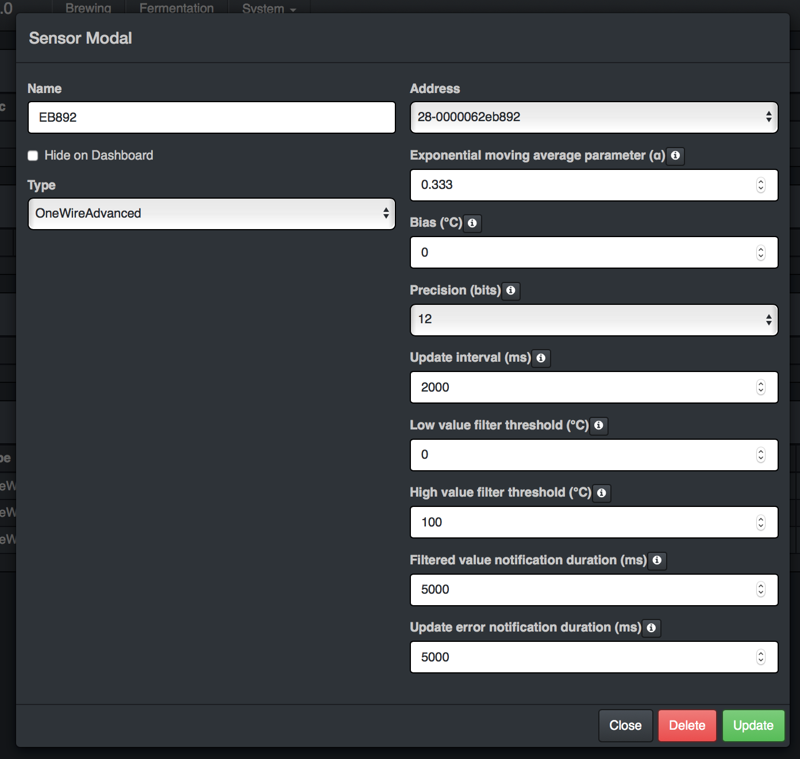

# Notice: as of May 22, 2019 this plugin is no longer being developed or maintained. For my recent work with brewery control software, please see my open-source brewing dashboard, [brew2](https://github.com/jangevaare/brew2).

## cbpi-OneWireAdvanced
### Introduction
This CraftBeerPi 3.0 plugin provides a new sensor type called OneWireAdvanced. This plugin attempts to provide even more control over DS18B20 temperature readings in CraftBeerPi. It allows setting of:
 * sensor bias,
 * sensor precision,
 * exponential moving average,
 * low and high value filters,
 * update interval, and,
 * alert options.

### Preview

